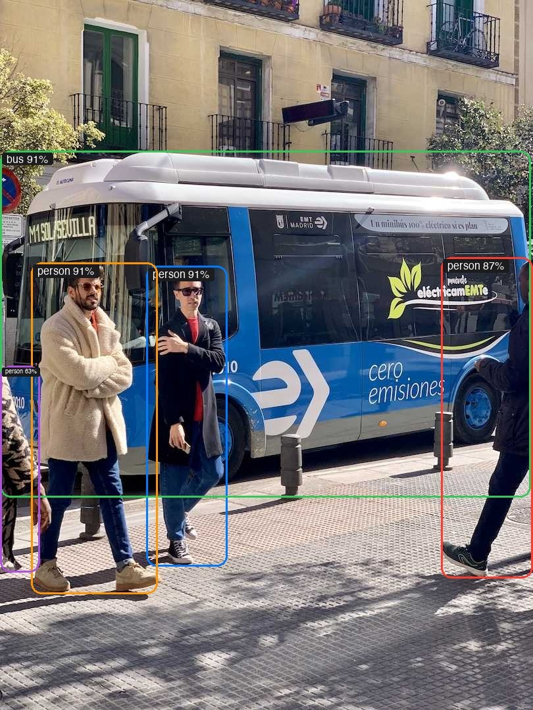
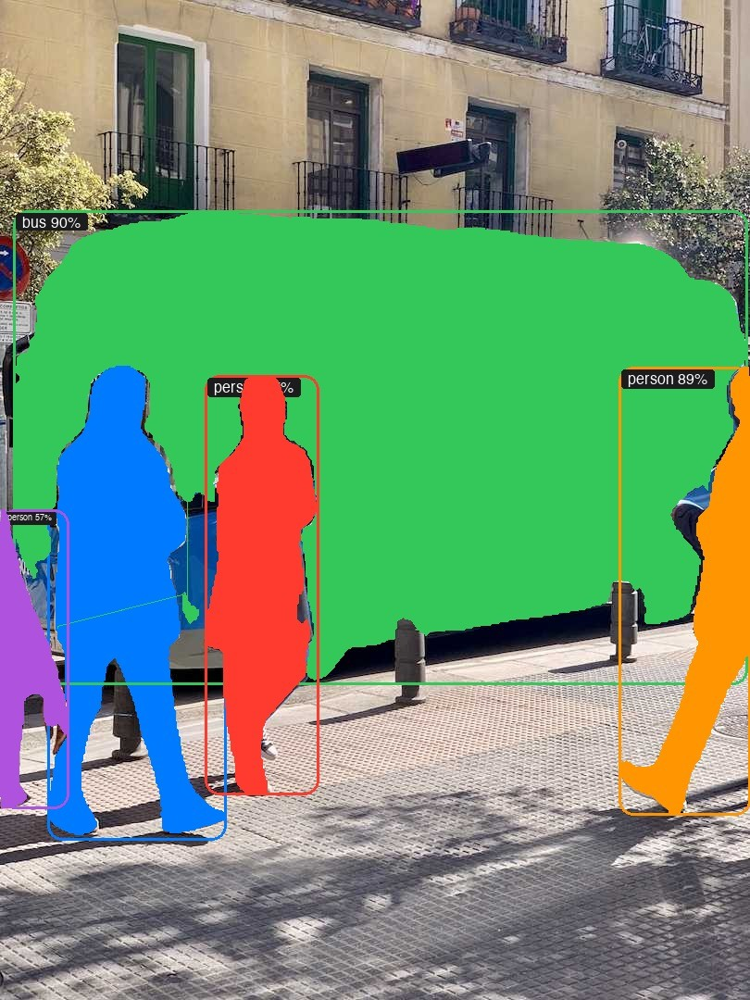
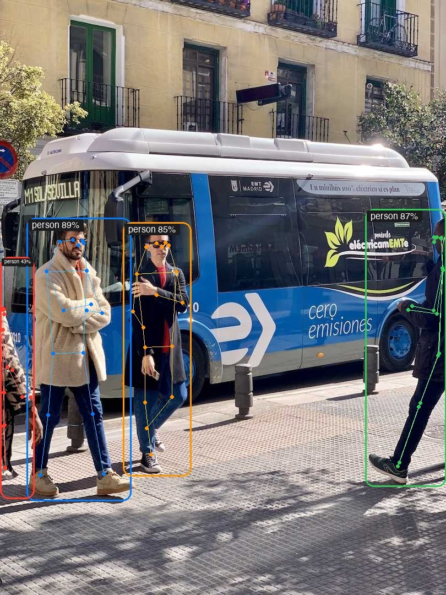

# YOLO26 视觉 AI 前端管理平台 🚀

> **YOLO26 Web — 基于浏览器的 YOLO 视觉 AI 工作站，支持目标检测、实例分割、姿态估计、分类、旋转框检测与目标跟踪。**

---

## 📖 写在前面

2022 年冬天，我开始做本科毕业设计，课题是小样本目标检测。那时候还是 YOLOv5 的天下，我每天窝在实验室里，对着黑漆漆的终端敲 `python train.py`，等上几个小时，看一串数字跳出来告诉我 mAP 提高了 0.3 个百分点。说实话，那时候我心里一直有个念头——为什么这些东西非要用命令行呢？为什么不能像 Photoshop 一样，左边选工具、右边调参数、中间是画布，点一下就能看到检测结果？为什么训练一个模型要手动改 YAML 文件里的参数，而不是在网页上点几个按钮就搞定？

我当时在毕业设计的「未来展望」章节里写过：希望有一天能做一个可视化的平台，把模型的训练、测试、检测都搬到网页上。但那时候我只是个本科生，会写 Python 脚本，会调参，会看论文，但不会写前端。那些想法只能留在 Word 文档的「展望」章节里，像一个遥远的梦。

然后到了 2026 年。Claude Code 来了。坐在电脑前，我打开这个尘封已久的项目文件夹，这一次我不再是一个人——我有了一个几乎无所不能的 AI 搭档。我说「我想要一个检测工作室，左边是工具栏，中间是画布，右边是参数面板」，它就开始写代码；我说「这里面的参数要完全对应 YOLO 的 default.yaml」，它就读了那个文件，把 68 个参数一个一个地搬到了网页上；我说「终端输出要实时显示在页面上」，它就打通了后端和前端。几百轮对话下来，我本科毕业设计里写下的每一个「未来展望」，都变成了可以点击的按钮、可以拖动的滑块、可以实时查看的画面。

这个项目既是我对计算机视觉的热爱，也是一个时代的见证——AI 不是来取代我们的，是来帮我们实现那些曾经「做不到」的事情的。希望你喜欢这个平台，也希望你也有一个被 AI 圆满的梦想。

📂 **GitHub**: [https://github.com/cleste-pome/Yolo26Web](https://github.com/cleste-pome/Yolo26Web)

---

## 📑 目录

- [效果预览](#-效果预览)
- [项目架构](#项目架构)
- [快速开始](#快速开始)
- [功能概览](#功能概览)
- [YOLO 任务支持](#-yolo-任务支持)
- [模型体系](#-模型体系)
- [API 参考](#-api-参考)
- [技术栈](#-技术栈)
- [项目结构](#-项目结构)
- [开发日志](#-开发日志)

---

## 🖼️ 效果预览

YOLO26 Large 模型在 COCO 数据集上的实测效果：

| 🔍 目标检测 | 🎯 实例分割 | 🧍 姿态估计 |
|:---:|:---:|:---:|
|  |  |  |
| 5人+1巴士，80类COCO检测 | 像素级掩码，COCO-Seg | 17关键点+骨架连线 |

检测框采用 **Apple 液态玻璃风格**——圆角细线框、毛玻璃标签、类别置信度自适应排版。分割任务绘制半透明多边形掩码，姿态任务绘制骨架连线与关键点。

---

## 项目架构

```
┌─────────────────────────────────────────────────────────────┐
│                    浏览器 (Frontend)                          │
│  ┌─────────┐  ┌──────────┐  ┌──────────┐  ┌──────────────┐ │
│  │ 首页总览  │  │ 检测工作室 │  │ 模型管理  │  │ 训练/测试台   │ │
│  └─────────┘  └──────────┘  └──────────┘  └──────────────┘ │
│                         │ fetch() API                         │
├─────────────────────────┼────────────────────────────────────┤
│              Flask Server (localhost:8050)                     │
│  ┌──────────┐  ┌──────────┐  ┌──────────┐  ┌──────────────┐ │
│  │ /api/     │  │ /api/     │  │ /api/     │  │ /api/         │ │
│  │ predict   │  │ train     │  │ models    │  │ history        │ │
│  └──────────┘  └──────────┘  └──────────┘  └──────────────┘ │
│                         │                                     │
│              ultralytics Python API                            │
│                         │                                     │
│              YOLO26 Models (weights/)                          │
└─────────────────────────────────────────────────────────────┘
```

---

## 快速开始

### 环境要求

| 依赖 | 版本 |
|------|------|
| Python | ≥ 3.8 |
| PyTorch | ≥ 1.8 |
| ultralytics | ≥ 8.4.0 |
| Flask | ≥ 3.0 |
| 浏览器 | Chrome / Safari / Edge (需支持 WebRTC) |

> ⚠️ **平台建议**：本项目在 **MacBook（macOS）** 上开发与测试，Safari / Chrome 下布局、字体、动画均为完整体验。Windows 系统下，不同浏览器的默认字体渲染、滚动条样式、表单控件尺寸存在差异，可能导致部分 UI 元素错位、面板折叠动画卡顿、以及 CSS Grid / Flexbox 表现不一致。建议优先在 Mac 上使用以获得最佳效果。

### 安装 & 启动

**🥇 推荐方式 — 双击启动（macOS）**

Finder 中双击 `Yolo26.command`，自动完成环境配置、启动后端、打开浏览器。

> 首次双击如提示「无法打开」，**右键 → 打开** 即可（macOS Gatekeeper 安全机制）。换一台新电脑 clone 后同样操作，只需一次。

**🥈 终端方式**

```bash
# 1. 克隆项目
git clone https://github.com/cleste-pome/Yolo26Web.git
cd Yolo26Web

# 2. 一键环境配置（仅首次）
bash launch.sh --setup

# 3. 启动（自动打开浏览器）
bash launch.sh
```

> 提示：如果 `./launch.sh` 报权限错误，改用 `bash launch.sh` 即可，无需 chmod。

启动后访问 **http://localhost:8050**，左侧导航切换各功能页面。

**🥉 直接打开了 HTML？**

如果直接双击 `Yolo26.html`，页面会弹出全屏遮罩提示后端未连接——这是正常的，因为后端服务还没启动。点击遮罩右上角 **✕** 关闭后浏览已缓存的页面，或点击 **🔄 重新连接** 检测后端是否已就绪。

> **Windows 用户**: 运行 `launch.bat --setup` 然后 `launch.bat`

### 模型权重

首次使用需下载模型权重（约 5-150 MB/个）。在「📥 模型管理」页面一键下载，或等待后端自动下载。

```bash
# 也可以手动下载到 weights/ 目录
# 从 https://github.com/ultralytics/assets/releases 下载 .pt 文件
mkdir -p weights
# 将 .pt 文件放入 weights/ 目录
```

---

## 功能概览

### 🏠 首页总览

项目的入口页面，提供快速导航和各功能模块的概览。

- 核心性能指标展示：57.5 mAP / 1.7ms GPU / 80+ 类别 / 20+ 格式
- 六种视觉任务卡片，点击直达检测工作室
- 一键进入核心功能
- 效果预览区域实时展示检测/分割/姿态实测图

### 🎯 检测工作室

**Photoshop 风格三栏布局** — 左侧工具面板 + 中央画布 + 右侧参数面板。

| 功能 | 说明 |
|------|------|
| 📹 实时摄像头检测 | 每 100-120ms 抓帧 → 后端 YOLO 推理 → 实时叠加框/掩码/骨架 |
| 🖼️ 图片上传检测 | 拖拽或点击上传 → 自动推理 → 标注图显示（不变形、不旋转） |
| 🔄 多任务切换 | 6 种任务独立模型，切换后恢复原图，手动点击检测 |
| 📋 检测记录 | 自动保存检测结果到磁盘（`history/`），支持回放和删除 |
| 💻 终端输出 | 实时显示 YOLO 推理日志、速度指标 |
| 🎛️ 可折叠参数面板 | 基础参数 + 高级参数 + 显示选项，共 15+ 可调参数 |

**检测参数：**

| 类别 | 参数 |
|------|------|
| 📐 基础 | 模型选择、推理设备、置信度、IoU、推理尺寸、最大检测数 |
| 🔧 高级 | 类别过滤、视频帧间隔、agnostic NMS、TTA、FP16、retina_masks、线宽 |
| 👁️ 显示 | 显示标签、显示置信度、显示锚框、线宽滑块、字号滑块 |

**三种在线主题：** ☀️ 浅色 → 🍂 暖色 → 🌙 深色，一键切换。

### 📊 模型管理

管理 25 个 YOLO26 预训练模型权重。自动检测本地已下载文件，实时显示下载状态。

| 功能 | 说明 |
|------|------|
| 模型对比表 | 检测/分割/姿态三种任务的性能对比（mAP、速度、参数量） |
| 模型下载 | 一键下载，自动保存到 `weights/` 目录 |
| 下载状态 | 实时显示（✅ 已下载 / 📥 待下载），支持按任务筛选 |

### ⚡ 训练控制台

完整的 YOLO 训练参数面板，**68 个可调参数**，完全对应 `ultralytics/cfg/default.yaml`。后端真实调用 `model.train()`，日志实时轮询显示。

```
┌──────────────────────┐  ┌────────────────────────────┐
│   Python 代码预览     │  │  📐 基础设置 (10 参数)       │
│                      │  │  🎮 训练控制 (18 参数)       │
│  from ultralytics    │  │  🔬 超参数 (7 参数)          │
│  import YOLO         │  │  📏 损失权重 (4 参数)        │
│                      │  │  🎨 数据增强 (15 参数)       │
│  model = YOLO(...)   │  │                            │
│  model.train(...)    │  │  [▶ 启动训练]               │
│                      │  │  ████████░░ 80%            │
└──────────────────────┘  └────────────────────────────┘
```

**5 个可折叠参数面板：**

| 面板 | 参数数 | 包含 |
|------|--------|------|
| 📐 基础设置 | 10 | 模型权重、数据集、轮数、尺寸、批次、设备、项目目录、实验名称、接着训练、覆盖结果 |
| 🎮 训练控制 | 18 | patience、save_period、cache、workers、pretrained、optimizer、seed、AMP、compile、fraction、freeze、multi_scale、cos_lr、close_mosaic、deterministic、single_cls、rect、verbose |
| 🔬 超参数 | 7 | lr0、lrf、momentum、weight_decay、warmup_epochs、warmup_momentum、warmup_bias_lr |
| 📏 损失权重 | 4 | box、cls、dfl、nbs |
| 🎨 数据增强 | 15 | HSV-H/S/V、degrees、translate、scale、shear、fliplr、flipud、mosaic、mixup、cutmix、copy_paste、erasing、BGR |

### 🧪 测试控制台

独立于训练的测试页面，支持三种模式：

| Tab | 功能 | 说明 |
|-----|------|------|
| `val()` 验证 | 后端调用 `model.val()` | 真实输出 mAP、P、R 等指标 |
| `predict()` 推理 | 后端调用 `model.predict()` | 真实推理结果 + 终端日志 |
| `export()` 导出 | 命令行提示 | 12 种导出格式 |

### 🔗 集成生态

| 集成 | 说明 |
|------|------|
| 📊 Weights & Biases | 实验追踪、超参优化、模型注册 |
| ☄️ Comet ML | 实验管理、可视化、生产监控 |
| 🤖 Roboflow | 数据标注、预处理、数据集管理 |
| 🔷 Intel OpenVINO | Intel 硬件优化推理 |
| 🔗 ONNX | 跨平台模型部署 |
| 🚀 TensorRT | NVIDIA GPU 加速 |
| 🍎 CoreML | Apple 生态部署 |

---

## 🎯 YOLO 任务支持

| 任务 | 英文 | 模型后缀 | 标注效果 |
|------|------|---------|----------|
| 🔍 目标检测 | Detection | `yolo26n.pt` ~ `yolo26x.pt` | Apple 圆角细线框 + 毛玻璃标签 |
| 🎯 实例分割 | Segmentation | `yolo26n-seg.pt` ~ `yolo26x-seg.pt` | 框 + 半透明多边形掩码 |
| 🧍 姿态估计 | Pose | `yolo26n-pose.pt` ~ `yolo26x-pose.pt` | 框 + 17关键点 + 骨架连线 |
| 🏷️ 图像分类 | Classification | `yolo26n-cls.pt` ~ `yolo26x-cls.pt` | Top-5 概率分布 |
| 📐 旋转框 | OBB | `yolo26n-obb.pt` ~ `yolo26x-obb.pt` | 旋转矩形框 |
| 👣 目标跟踪 | Tracking | 复用检测模型 | 框 + 追踪 ID 编号 |

标签自动适应框大小：宽框横排（`人 91%`）→ 窄框竖排（`人` 上 `91%` 下）→ 极窄仅显示类别。

---

## 📊 模型体系

```
                    ┌──────────┐
                    │  YOLO26   │
                    └────┬─────┘
           ┌─────────────┼─────────────┐
           │             │             │
      ┌────▼────┐  ┌────▼────┐  ┌────▼────┐
      │ Detect  │  │Segment  │  │  Pose   │  ...
      └────┬────┘  └────┬────┘  └────┬────┘
     ┌─────┼─────┐      │           │
     │     │     │      │           │
    Nano Small Medium Large    X-Large
```

**5 种规模 × 5 种任务 + 1 种跟踪 = 25 个预训练模型**，全部存储在 `weights/` 目录。

| 变体 | mAP 50-95 | T4 速度 | 参数量 | 计算量 |
|------|-----------|---------|--------|--------|
| **YOLO26n** | 40.9 | 1.7ms | 2.4M | 5.4B |
| **YOLO26s** | 48.6 | 2.5ms | 9.5M | 20.7B |
| **YOLO26m** | 53.1 | 4.7ms | 20.4M | 68.2B |
| **YOLO26l** | 55.0 | 6.2ms | 24.8M | 86.4B |
| **YOLO26x** | 57.5 | 11.8ms | 55.7M | 193.9B |

> 默认识别模型为 **Large（yolo26l.pt）**。Apple Silicon >8GB 内存时推理尺寸自动设为 1280。

---

## 📡 API 参考

| 方法 | 端点 | 说明 |
|------|------|------|
| GET | `/api/health` | 健康检查 |
| GET | `/api/system/info` | 设备/内存信息 |
| POST | `/api/predict` | 图片推理（base64/URL/文件路径） |
| POST | `/api/train` | 启动训练任务 |
| GET | `/api/train/status/<id>` | 训练进度 + 实时日志轮询 |
| POST | `/api/val` | 运行模型验证 |
| GET | `/api/models/available` | 模型列表（含下载状态） |
| GET | `/api/models/info` | 分组模型列表（供下载网格） |
| POST | `/api/models/download` | 下载模型权重 |
| POST | `/api/history/save` | 保存检测历史 |
| GET | `/api/history/list` | 历史记录列表 |
| DELETE | `/api/history/delete/<id>` | 删除单条记录 |
| DELETE | `/api/history/clear-all` | 批量清空全部记录 |

### 推理请求示例

```bash
curl -X POST http://localhost:8050/api/predict \
  -H "Content-Type: application/json" \
  -d '{"model":"yolo26n.pt","task":"detect","conf":0.3,"source":"image.jpg"}'
```

响应包含：检测框坐标、类别、置信度、推理速度、Apple 风格标注图（base64）、终端输出。

---

## 🛠 技术栈

| 层级 | 技术 |
|------|------|
| 前端 | HTML5 + CSS3 + Vanilla JavaScript（无框架） |
| 后端 | Python Flask + flask-cors |
| AI 引擎 | ultralytics (PyTorch) |
| 数据库 | SQLite (state_manager) |
| 存储 | 磁盘文件 (history/ + uploads/ + runs/) |
| 字体 | Inter + Noto Sans SC + Helvetica |
| 启动 | `.command` 双击启动 / `launch.sh` / `launch.bat` |

---

## 📂 项目结构

```
Yolo26Web/
├── Yolo26.html         # 前端主页面（单文件，完整多页应用）
├── Yolo26.command       # macOS 双击启动器
├── server.py           # Flask 后端服务器
├── state_manager.py    # 纯净态模型版本管理
├── launch.sh           # macOS/Linux 启动脚本
├── launch.bat          # Windows 启动脚本
├── requirements.txt    # Python 依赖
├── CLAUDE.md           # Claude Code 项目指南
├── README.md           # 本文件
├── experiments.db      # 实验记录数据库（SQLite）
├── states.db           # 纯净态状态数据库（SQLite）
├── datasets/           # 示例数据集（coco8）
├── uploads/            # 用户上传图片的临时目录
├── examples/           # 效果预览示例图
├── weights/            # 模型权重目录（.pt 文件不上传 git）
│   └── .gitkeep
├── history/            # 检测历史记录文件夹
│   └── .gitkeep
├── runs/               # 训练/验证输出目录
└── yolo26/             # YOLO 核心库（ultralytics）
```

> **注意**：`weights/*.pt` 模型权重文件不会上传到 GitHub（已在 `.gitignore` 中排除），请通过项目内置的「模型管理」页面下载。`history/*.jpg` 和 `history/*.json` 不上传，仅保留文件夹结构。

---

## 🔧 开发日志

| 序号 | 里程碑 |
|------|--------|
| 1 | 🏗️ 搭建 Flask 后端 + YOLO API 封装，跑通第一个实时推理 |
| 2 | 🎨 前端从零开始——首页、侧边栏、检测工作室的三栏布局 |
| 3 | 📹 实时摄像头检测 + 图片上传推理，解决坐标映射、Canvas 渲染 |
| 4 | ⚡ 训练控制台 + 测试控制台，68 个参数逐一从 default.yaml 迁移 |
| 5 | 🔄 多任务切换、检测历史存储、Photoshop 风格折叠面板 |
| 6 | 🎨 三主题切换、文件路径选择器、API 全面测试 |
| 7 | 📖 写 README |
| 8 | 🖼️ Apple 风格检测框、分割掩码、姿态骨架、追踪 ID |
| 9 | 🚀 模型管理修复、训练/测试真实 API、内存自适应推理尺寸 |

---

## 📄 许可证

本项目代码采用 MIT 许可证。

YOLO26 模型权重版权归 [Ultralytics](https://www.ultralytics.com/) 所有，采用 AGPL-3.0 许可证。商业使用需获取 [Ultralytics Enterprise License](https://www.ultralytics.com/license)。

---

> *"四年前写在毕业设计未来展望里的梦想，被 AI 一行一行地写成了现实。"*
